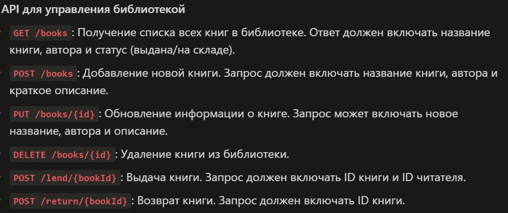

# Экзамен по КПО

Задание:

Для запуска проекта, нужно открыть его в Intellij IDEA и нажать на зеленый треугольник

Документацию можно посмотреть по ссылку http://localhost:8080/swagger-ui/index.html (если вы запустили приложение на другом порту, то укажите его вместо 8080)

Можно подключиться к базе данных по ссылке 